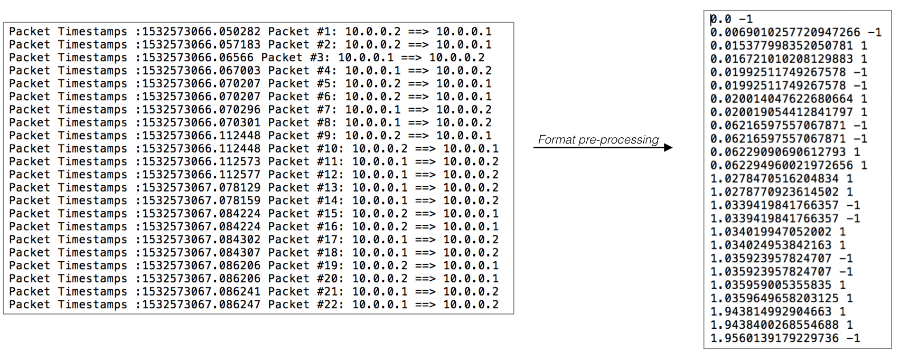
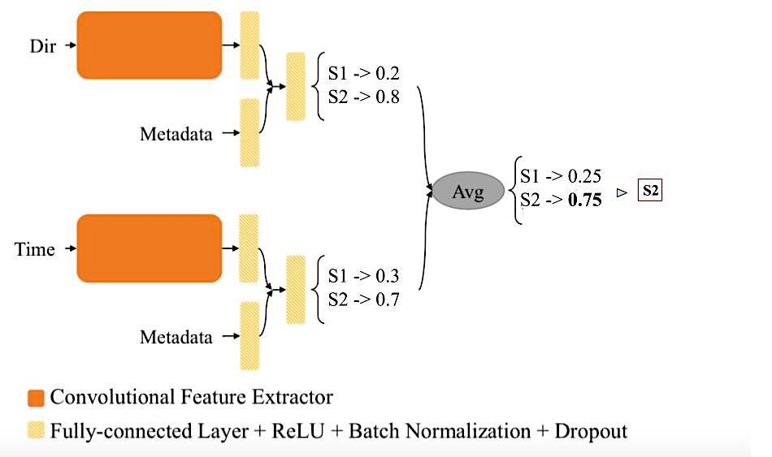

# A Deep Learning-based fingerprinting attack on the Sovrin ecosystem.

This project was develloped in collaboration with the Sovrin foundation. Sovrin offers a blockchain-based ecosystem for self-sovereign identity and allows users to exchange personal information with organizations without being concerned about data privacy problems. The purpose of this work is to analyze and test a particular deep learning method to temper the Sovrin privacy system. 

We adapted a powerful deep learning approach based on a custom VGG architecture to extract hidden patterns from users' traffic traces. Our main contribution in this work are :

- Proposing two scenarios explaining how to apply our model for profiling users from predicted samples. 

- Search for different sources of correlatable data. 

- Using the Indy-SDK, a framework provided by the Sovrin project community, we created a simulation that makes a set of users interacting with different organizations and collected network traffic information from these interactions. 

We successfully trained our deep convolutional neural networks model to classify users behaviours based on their network traffic data and achieved respectively accuracy score of 99.61% for the binary classification problem and 8.52% for a multi-class task with 247 classes.

For details about Sovrin check the following documentation:
- [Sovrin]https://sovrin.org/
- [White paper]https://sovrin.org/wp-content/uploads/2018/03/Sovrin-Protocol-and-Token-White-Paper.pdf


Code as part of MSc Advanced Computing Individual Project (Imperial College London 2018)

## Based on

Var-CNN implementation  and (devadas et al., 2018)[https://arxiv.org/abs/1802.10215] paper for deep neural network model implementation.


## Requirements : 

Code has been developed using Python 2 and Python 3 (for additionnal scripts and simulator) with the following library:

- Keras (TensorFlow backend )
```
pip install tensorflow-gpu
pip install keras
```
- Indy-SDK (Python wrapper)

Refer to: https://github.com/hyperledger/indy-sdk

- Pandas
```
pip install pandas
```
- ScaPy: A Python network analyzer library.
```
pip install scapy
```
- Sickit-learn
```
pip install -U scikit-learn
```

### Hyperledger Indy-SDK

To generate users' traffic traces dataset, we implemented a transactions simulator between a pool of random users and organizations. From all transaction, we captured traffic traces using a Scapy script and save data into text files. In order to reproduce simulation and generate the dataset, please refer to the Indy-SDK repository :

Hyperledger Indy-sdk : https://github.com/hyperledger/indy-sdk

1. Follow instructions to install all dependency

2. Replace `indy-sdk/samples/python/src` direcotry by `Data Simulator/src`

3. Refer to the following documentation to install the simulation environment:

- https://github.com/hyperledger/indy-sdk/blob/master/doc/getting-started/getting-started.md
- https://github.com/hyperledger/indy-sdk/blob/master/doc/getting-started/run-getting-started.md

4. Once you started the docker indy pool, run `Data Simulator/src/multiprocess_generator.py` to launch the simulator. Do not forget to modify the .txt filee target directory in `sniff.py`.

### DataSet

Our generated dataset contains traffic traces for ~12.000 transactions between users and related organisations. We generated data for 247 users making two kinds of credential exchanges :

- Requesting a university transcript to an academic organization.
- Requesting a job certificate to a company.

Once collecting raw network data, we used tools in /scripts to convert them to a format that can be proccess by our model as shows above : 



A .txt data file contains two sequences:

- All packet timestamps of a transaction.
- All corresponding packet direction (encoded to -1 for outgoing packets and 1 incoming packets).

### Training the model

The model implementation and architecture was based on the (Devadas et al. 2018) Var-CNN model. Var-CNN uses model variations on convolutional neural networks (VGG) with both packet sequence and packet timing data. We build and train the model on a closed-world configuration (i.e considering a closed well known set of labels). 

This model's architecture considers two state-of-the art optimized 1D Convolutional neural networks, each processing one of our data sequences. 



The final output is computed by combining both network predictions. Here, we model two differents label vectors:

- A 247 classes vector, which aims to classify user's idendity by learning pattern specific to each user in their traffic traces (Multi-class problem).

- A Binary class vector, which classifies the type of credential exchanged by users, either job certificate or university transcript requests (Binary-class problem).

Implementation for both problems is available in `/Implementation` directory. You can run Tensorboard to follow live training process.

Trained for ~4 hours on Nvidia TITAN X.

### Results

To run the training procedure and test model on prediction for either multi-class or binary-class problem:

1. Run `preprocess_data_.py` setting the number of users monitored and the number of observations per user in test and train sets. Do not forget to change data directory. This first script process .txt data files to numpy tensors, perform one-hot encoding, data shuffling and sequences reshaping.

2. Run `var_cnn_ensemble_.py` to start training routine. Feel free to modify hyperparameters variables. Do not forget to change preprocessed data directory path.

3. Run `evaluation_ensemble.py` to compute final accuracy. Do not forget to change `preprocess` and `predictions`directory path. (Run for closed-world only).

After hyperparamters fine-tuning, we finally achieved:
- 8.52% of accuracy for the multi-class problem. 
- 99.61% of accuracy for the binary-class problem.

This shows that despite the simplicity of our dataset, we achieved to extract patterns that are specific to the type of the exchanged credentials. Thus, we can predict behaviours of the monitored users in order to profile them. This shows breaches into Sovrin privacy system.

Classifying users regarding their whole traffic does not currently give high accuracy (binary-class problem). However, this is mainly due to the lack of diversity within our dataset. Improving our dataset with real-world data would increase the ability of the model to detect patterns that are specific to user identity.

### Future works

Further version and research on this work would include the following improvements:

- Our dataset was generated following a simple schema of transactions (including only 2 types of exchanged credentials). We aim to improve our simulator to be more realistic and generates data that better reflect real-world configuration.

- Improving the model's architecture to reach better results (VGG --> ResNet).


## Acknowledgments

* Sanjit Bhat.
* Dominik Harz.
* The Hyperledger-Indy community.
